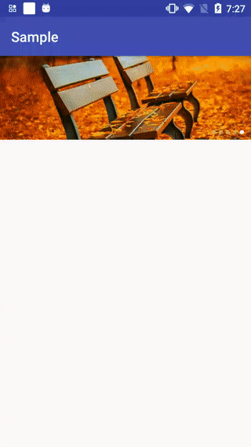

# Banner
Banner is an open source Android library that allows developers to easily create an ad rotation effect widget like those made in Tmall，Taobao apps.

### ScreenShot


### Gradle
```groovy
dependencies {
    compile 'com.github.ShortStickBoy:Banner:V1.0.3'
}
```

### Use
```groovy
    <com.sunzn.banner.library.Banner
        android:id="@+id/banner"
        android:layout_width="match_parent"
        android:layout_height="120dp"
        app:indicator_gravity="right"
        app:indicator_gain="@drawable/svg_indicator_icon_gain"
        app:indicator_miss="@drawable/svg_indicator_icon_miss" />
```

| Attribute         | Describe                               | Additional                                         |
| ----------------- | -------------------------------------- | -------------------------------------------------- |
| banner_inch       | Milliseconds per inch                  | The greater the value, the slower the slide        |
| banner_interval   | Waiting time before next slide         | The greater the value, the longer the wait         |
| indicator_show    | Whether to display the indicator       | True display, false not displayed                  |
| indicator_gain    | Indicator drawable when gets the focus | Support color, svg and image reference             |
| indicator_miss    | Indicator drawable when lost the focus | Support color, svg and image reference             |
| indicator_size    | Indicator icon size                    | The larger the value, the larger the icon          |
| indicator_space   | Indicator icon spacing                 | The larger the value, the larger the icon interval |
| indicator_margin  | Indicator_margin                       | The larger the value, the larger the margin        |
| indicator_gravity | Indicator_gravity                      | Default center, support left, right                |

### License
```
    Copyright [2017] sunzn

    Licensed under the Apache License, Version 2.0 (the "License");
    you may not use this file except in compliance with the License.
    You may obtain a copy of the License at

       http://www.apache.org/licenses/LICENSE-2.0

    Unless required by applicable law or agreed to in writing, software
    distributed under the License is distributed on an "AS IS" BASIS,
    WITHOUT WARRANTIES OR CONDITIONS OF ANY KIND, either express or implied.
    See the License for the specific language governing permissions and
    limitations under the License.
```